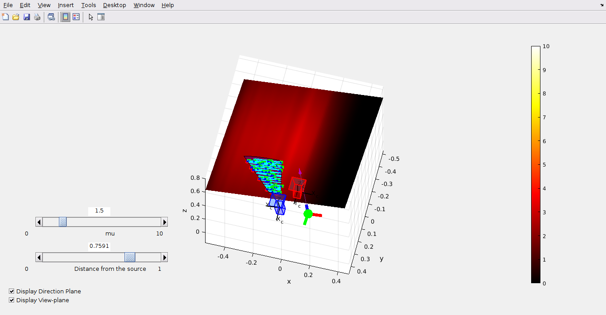

# ***MAJOR UPDATES COMING SOON***

## Non-Isotropic Light Source Simulation

A hyperspectral camera requires a powerful directed light source that will illuminate a surface of interest that is being captured. Understanding how the radiant intensity of this source is distributed across this surface can aid in trying to estimate material properties from the hyperspectral images. This work aims to build a probabilistic point model of a single **near-field non-isotropic** light source using a **Gaussian Process** with a **non-zero mean function**. Non-isotropic behaviour means that the light source has a **principal direction** where radiant intensity is the highest.

The hyperspectral camera we have worked with captures in a line-scan manner, so therefore, we have incorporated an RGB frame camera to compensate for the missing dimension. The frame camera coordinate frame is **always** treated to be the world coordinate frame. This work assumes the camera system has been calibrated prior.

Relevant script: **main_light_simulation.m**

Simulates a near-field non-isotropic disk light source using a real measured RID and fits the following regression models to the irradiance:

- Least squares
- GP with zero-mean
- GP with constant-mean
- GP with light-source-mean

The results are saved in `light_sim_results`

