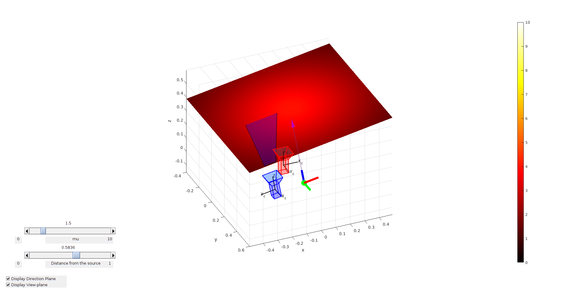

# ***MAJOR UPDATES COMING SOON***

# light_source_modelling
A hyperspectral camera requires a powerful directed light source that will illuminate a surface of interest that is being captured. Understanding how the radiant intensity of this source is distributed across this surface can aid in trying to estimate material properties from the hyperspectral images. This work aims to build a probabilistic point model of a single **near-field non-isotropic** light source using a **Gaussian Process** with a **non-zero mean function**. Non-isotropic behaviour means that the light source has a **principal direction** where radiant intensity is the highest.

The hyperspectral camera we have worked with captures in a line-scan manner, so therefore, we have incorporated an RGB frame camera to compensate for the missing dimension. The frame camera coordinate frame is **always** treated to be the world coordinate frame. This work assumes the camera system has been calibrated prior.

There are three key components to this work:

1. Realistic light simulator with a real RID curve to validate GP light source model (single band)

2. Real data captured using camera system

   ​	a. Captured frame images to triangulate the location and direction of light source in world coordinates

   ​	b. Captured frame and hyperspectral images to build the GP model w.r.t to the light source.

3. Estimate reflectance using different methods which incorporate the radiant intensity information from the GP light model

## Light Source Simulator

MATLAB Simulator 

## main_light_modelling

This script is used to build the light source model using collected data from the camera system for each of the bands of the hyperspectral camera. Each band will have a GP and least-squares model.

The script can be run using data located in the `test_data` directory. The parameter `UseTestData` will need to be set to **true** in the YAML parameter file located at `\parameter_files\light_source_modelling.yaml`

# Completed

- Simulator visualisation is working with point source
- Sample the space with a small target
- Obtain the symmetrical sample about the light source position and direction on the view-plane of the line-scan camera
- Estimate light parameters through LS with both points and symmetric points
- Build the light source model using zero-mean GP with SE kernel without symmetric points
- Build the light source model using zero-mean GP with SE kernel with symmetric points
- Build the light source model using constant-mean GP with SE kernel with symmetric points

# To-Do

- Clean up code
- Write mean function for the light source with light source parameters as hyper-parameters which will need to be trained.
- Build the light source model using new mean function GP with SE kernel with/without symmetric points
