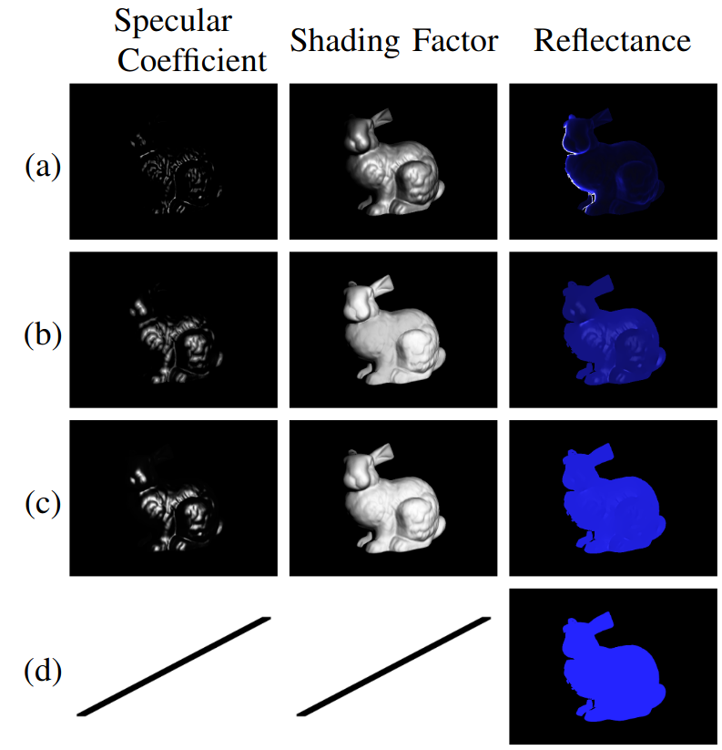

## Supplementary materials for "Multi-modal Non-Isotropic Light Source Modelling for Reflectance Estimation in Hyperspectral Imaging "

This page contains datasets and supplementary materials for the paper.

### Implementation of the light source estimation

The github repository providing the implementation of the light source estimation is available [here](https://github.com/jmehami1/MMHS-RE).

### Mitsuba Simulations

We forked the 1st version of [Mitsuba](https://www.mitsuba-renderer.org/index_old.html) to render hyperspectral-like hypercubes and RGB images of a scene.

There are two different branches which need to **cloned**, **compiled** and **built**:

- [Mitsuba RGB simulator](https://github.com/jmehami1/mitsuba/tree/master)
- [Mitsuba Spectral simulator](https://github.com/jmehami1/mitsuba/tree/spectral) 

These repositories should be in separate directories. The spectral version renders hypercubes of 100 channels.

The scene files to render examples from the paper are found in [here](https://drive.google.com/file/d/15_dZxSGzgQUROp-pKEY7Gn8SvvX6r1b1/view?usp=sharing). The README will describe the process to generate datasets.

### Supplementary material for the paper

The supplementary material for the paper is available [here](https://drive.google.com/file/d/1SxRDQslgx4DHqqKqA2xz2Qg-8DNb6T10/view?usp=sharing).
