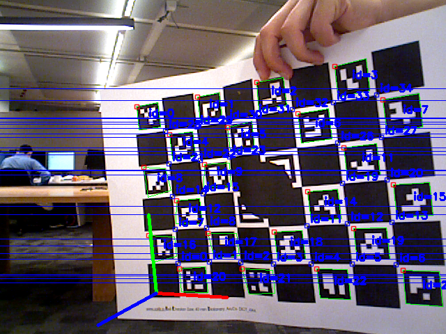
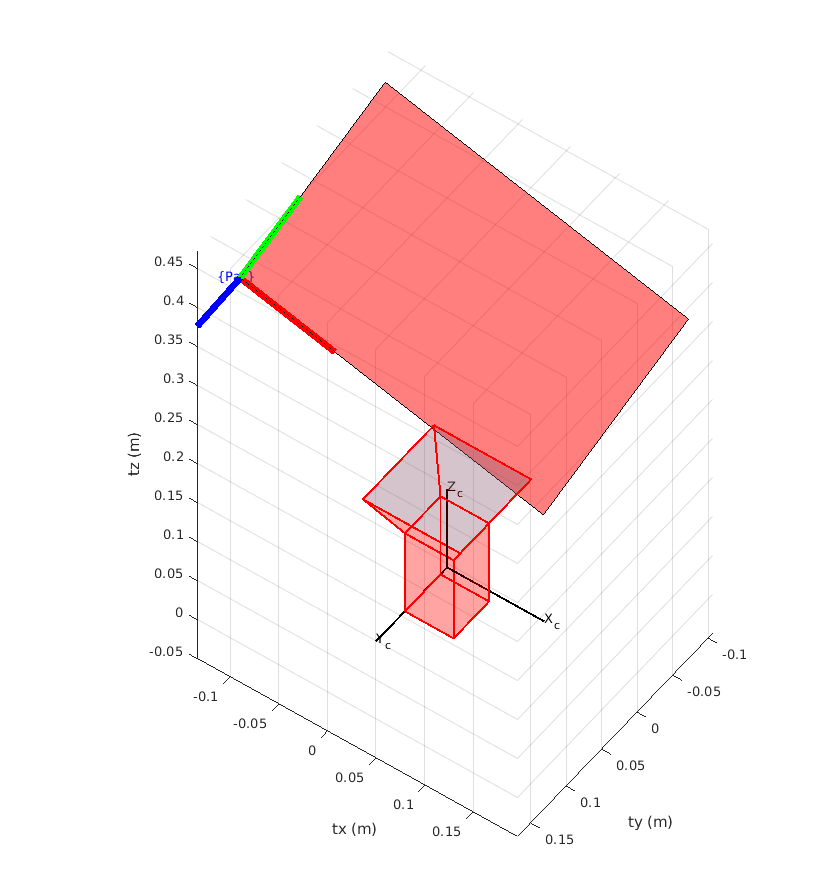

# mex_ChArUco_Pose

The mex interface function for getting the pose of a ChArUco board pattern from the native OpenCV implementation in C++. Link to OpenCV document can be found [here](https://docs.opencv.org/3.4/df/d4a/tutorial_charuco_detection.html).

The Mex file should be located in the `bin` directory with the name `CharucoPoseEst.mexa64`. There is an included test script to see how it works.

**To run the Mex file OpenCV must be installed.**

## Building Mex File

Create a `build` directory inside current directory.

In a terminal pointing to build run the following:

```bash
cmake ..
make
```

The built Mex file can be found in the  `bin`  directory.

## ChArUco Board


## Detected Pose



## Matlab Plot

